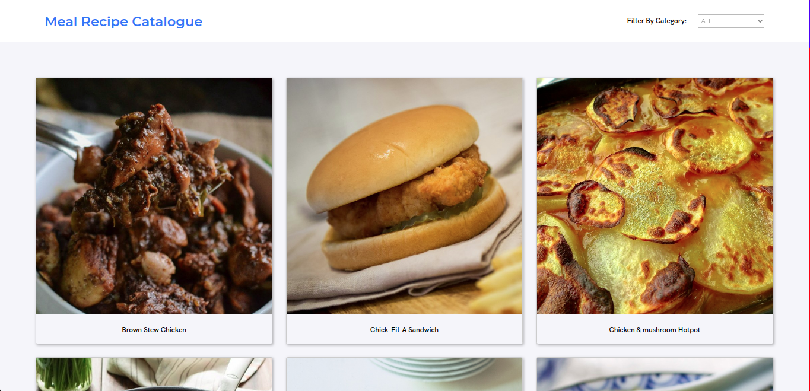

<h1 align="center">Welcome to Catalogue of Meal Recipe App 👋</h1>
<p>
  
  <a href="https://twitter.com/abruzy01" target="_blank">
    
  </a>
</p>

> A Simple Bookstore App built using React and using redux for state managemnt. This app provides you the recipes for the best dishes. Browse per category of dishes and find the recipe for you favourite dish. You can also find dishes based on the type of recipes you want.

> NB: In this project, I was ask to build a catalogue of dog clothes but I search the web and couldn't find one, so I decided to use MEALDB API isntead for this app



## Built With

- Major languages - JavaScript, HTML5, SCSS,
- frameworks - ReactJS

### ✨ Live Demo

[Live Demo Link](https://recipitia-app.herokuapp.com/)

## Getting Started

To get a local copy up and running follow these simple steps.

### Prerequisites

- nodejs must be installed on device

### Install

- Follow this steps according to get you running

1. clone the repo

```sh
git clone git@github.com:abruzy/react-meal-catalogue.git
```
2. change directory 
```sh
cd react-meal-catalogue
```

3. install dependencies

```sh
yarn install
```

4. start the project

```sh
yarn start
```

## To run test
```sh
yarn test
```

## Author

👤 **Abubakar Diallo**

* Twitter: [@abruzy01](https://twitter.com/abruzy01)
* Github: [@abruzy](https://github.com/abruzy)
* LinkedIn: [@abubakardiallo](https://linkedin.com/in/abubakardiallo)

## 🤝 Contributing

Contributions, issues and feature requests are welcome!

Feel free to check the [issues page](https://github.com/abruzy/react-meal-catalogue/issues).

## Show your support

Give a ⭐️ if you like this project!

## Acknowledgments

- [Microverse](https://www.microverse.org/)

## 📝 License

This project is [MIT](lic.url) licensed.